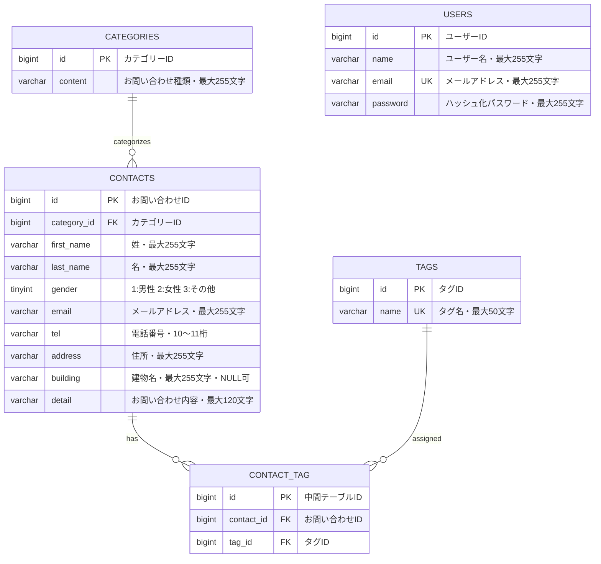

# お問い合わせフォーム

Laravel 10を使用して開発した、お問い合わせフォーム管理アプリケーションです。

一般ユーザー向けのお問い合わせフォームに加えて、管理画面利用者向けの認証機能、お問い合わせ管理機能、タグ管理機能、CSVエクスポート機能を実装しています。

また、HTTPリクエストを通してお問い合わせ情報を操作できる公開APIと、その動作を確認する自動テストも実装しています。

## 概要

このプロジェクトは、Laravelを使用したWebアプリケーション開発の流れを学び、実務を意識した設計・実装・テスト・Git運用を経験することを目的として制作しました。

一般ユーザーは、お問い合わせカテゴリーやタグを選択して、お問い合わせを送信できます。入力内容は確認画面で確認・修正でき、送信後はデータベースへ保存されます。

管理画面では、お問い合わせの検索、絞り込み、詳細確認、削除、CSVエクスポートを行えます。また、管理画面で使用するタグの登録・編集・削除にも対応しています。

公開APIでは、お問い合わせの一覧取得、詳細取得、新規登録、更新、削除をJSON形式で行えます。

開発では、機能ごとにGitHub Issueと作業ブランチを作成し、Pull Requestを通して`main`ブランチへマージする運用を行いました。

## 主な機能

### 一般ユーザー向け機能

- お問い合わせフォームの表示
- お問い合わせカテゴリーの選択
- お問い合わせに付けるタグの選択
- 入力内容のバリデーション
- 入力内容の確認画面表示
- 入力内容を保持した状態での修正
- お問い合わせ内容のデータベース保存
- 選択したタグとお問い合わせの関連付け
- 送信完了後のサンクスページ表示

### 管理画面利用者向け機能

- 管理画面利用者の登録
- ログイン
- ログアウト
- 未認証ユーザーのアクセス制御
- お問い合わせ一覧表示
- キーワード検索
- 性別による絞り込み
- カテゴリーによる絞り込み
- 日付による絞り込み
- 複数条件を組み合わせた検索
- 検索条件を保持したページネーション
- お問い合わせ詳細表示
- お問い合わせに設定されたタグの表示
- お問い合わせ削除
- 検索条件を反映したCSVエクスポート
- タグの登録
- タグの編集
- タグの削除

> 管理画面では、既にお問い合わせへ設定されているタグを確認できます。
> 管理画面からお問い合わせへタグを追加・変更する機能は実装していません。

### 公開API

- お問い合わせ一覧取得
- キーワード・性別・カテゴリー・日付による絞り込み
- ページネーション
- 1ページ当たりの表示件数指定
- お問い合わせ詳細取得
- お問い合わせ新規登録
- お問い合わせ更新
- お問い合わせ削除
- 登録時のタグ関連付け
- 更新時のタグ同期
- FormRequestによるAPI用バリデーション
- API ResourceによるJSONレスポンスの整形
- 存在しないお問い合わせIDへの404レスポンス
- バリデーション失敗時の422レスポンス

### テスト

- お問い合わせフォームの機能テスト
- 管理者ログインとアクセス制御の機能テスト
- 管理画面の検索・ページネーションに関する機能テスト
- お問い合わせ詳細表示・削除に関する機能テスト
- タグの登録・更新・削除に関する機能テスト
- 公開APIの一覧・詳細・登録・更新・削除に関する機能テスト
- FormRequestのバリデーション単体テスト
- Eloquentモデルのリレーション単体テスト
- Factoryを使用したテストデータの生成

## ER図

以下は、アプリケーションの主要なテーブルとリレーションを示したER図です。

`created_at`、`updated_at`、`remember_token`、`email_verified_at`、二要素認証用カラムなど、主要機能の説明に直接関係しないカラムは省略しています。



### テーブルの関連

- `categories`と`contacts`は、1対多の関係です。
- 1件のお問い合わせは、必ず1つのカテゴリーに所属します。
- 1つのカテゴリーには、0件以上のお問い合わせを登録できます。
- `contacts`と`tags`は、多対多の関係です。
- 多対多の関係は、中間テーブルの`contact_tag`で管理します。
- 1件のお問い合わせには、0個以上のタグを設定できます。
- 1つのタグは、0件以上のお問い合わせに設定できます。
- `users`は、認証済みの管理画面利用者を管理する独立したテーブルです。
- `users`と、ほかの主要テーブルの間に外部キーによる関連はありません。

### カーディナリティ

| 親テーブル   | 子テーブル    | 関係                        |
| ------------ | ------------- | --------------------------- |
| `categories` | `contacts`    | 1対多                       |
| `contacts`   | `contact_tag` | 1対多                       |
| `tags`       | `contact_tag` | 1対多                       |
| `contacts`   | `tags`        | `contact_tag`を介した多対多 |

### 外部キー制約

| テーブル      | 外部キーカラム | 参照先          | 参照先削除時の処理                   |
| ------------- | -------------- | --------------- | ------------------------------------ |
| `contacts`    | `category_id`  | `categories.id` | 関連するお問い合わせを削除           |
| `contact_tag` | `contact_id`   | `contacts.id`   | 関連する中間テーブルのレコードを削除 |
| `contact_tag` | `tag_id`       | `tags.id`       | 関連する中間テーブルのレコードを削除 |

### ユニーク制約

| テーブル      | 対象カラム                         |
| ------------- | ---------------------------------- |
| `users`       | `email`                            |
| `tags`        | `name`                             |
| `contact_tag` | `contact_id`と`tag_id`の組み合わせ |

`contact_tag`では、同じお問い合わせに同じタグが重複して登録されないように、`contact_id`と`tag_id`の組み合わせへユニーク制約を設定しています。

## 使用技術

| 分類                 | 使用技術                                         |
| -------------------- | ------------------------------------------------ |
| バックエンド         | PHP 8.2、Laravel 10.x                            |
| フロントエンド       | Blade、HTML、CSS、JavaScript                     |
| CSSフレームワーク    | Tailwind CSS 3.4                                 |
| JavaScriptライブラリ | Alpine.js                                        |
| ビルドツール         | Vite                                             |
| データベース         | MySQL 8.0                                        |
| データベース管理     | phpMyAdmin                                       |
| 認証                 | Laravel Fortify                                  |
| 開発環境             | Docker Desktop、Laravel Sail                     |
| パッケージ管理       | Composer、npm                                    |
| テスト               | PHPUnit、Laravel Unit Test、Laravel Feature Test |
| コード整形           | Laravel Pint                                     |
| バージョン管理       | Git、GitHub                                      |
| API動作確認          | Postman                                          |

## 環境構築手順

以下は、完成済みのリポジトリを取得して、アプリケーションを起動する手順です。

### 1. 必要なソフトウェアをインストールする

環境構築を始める前に、以下のソフトウェアをインストールしてください。

- Git
- Docker Desktop

Docker Desktopは、起動した状態で作業してください。

Windows環境では、WSL2上でコマンドを実行してください。

### 2. リポジトリをクローンする

以下のコマンドを実行し、GitHubからプロジェクトを取得します。

```bash
git clone https://github.com/rn1052289-oss/contact-form-app.git
```

プロジェクトのディレクトリへ移動します。

```bash
cd contact-form-app
```

### 3. Composerパッケージをインストールする

Docker上のComposerを使用して、Laravelの動作に必要なPHPパッケージをインストールします。

```bash
docker run --rm \
    -u "$(id -u):$(id -g)" \
    -v "$(pwd):/var/www/html" \
    -w /var/www/html \
    -e COMPOSER_CACHE_DIR=/tmp/composer_cache \
    laravelsail/php82-composer:latest \
    composer install
```

このコマンドにより、`vendor`ディレクトリとLaravel Sailの実行ファイルが作成されます。

### 4. `.env`ファイルの設定を確認する

Laravelプロジェクトの作成時に、`.env.example`から`.env`が自動的に作成されます。

さらに、Laravel Sailのインストール時に、Docker環境で利用するデータベース接続情報が`.env`へ設定されます。

`.env`を開き、以下の設定になっていることを確認してください。

```env
APP_NAME="Contact Form App"
APP_ENV=local
APP_KEY=
APP_DEBUG=true
APP_URL=http://localhost

DB_CONNECTION=mysql
DB_HOST=mysql
DB_PORT=3306
DB_DATABASE=laravel
DB_USERNAME=sail
DB_PASSWORD=password
```

> [!IMPORTANT]
> `DB_HOST`には、`localhost`や`127.0.0.1`ではなく、Dockerコンテナのサービス名である`mysql`を指定してください。

`.env`にはデータベースのパスワードなどが含まれるため、Gitへコミットしないでください。
`.gitignore`に`.env`が含まれていることを確認してください。

### 5. phpMyAdminの設定を確認する

`compose.yaml`にphpMyAdminの設定が含まれていることを確認します。

phpMyAdminが未設定の場合は、`mysql`サービスの後に以下を追加してください。

```yaml
phpmyadmin:
    image: "phpmyadmin:latest"
    ports:
        - "${FORWARD_PHPMYADMIN_PORT:-8080}:80"
    environment:
        PMA_HOST: mysql
        PMA_USER: "${DB_USERNAME}"
        PMA_PASSWORD: "${DB_PASSWORD}"
    networks:
        - sail
    depends_on:
        - mysql
```

設定後、Composeファイルの構文を確認します。

```bash
docker compose config
```

エラーが表示されなければ、設定は完了です。

#### Apple Silicon搭載Macを使用する場合

M1、M2、M3、M4などのApple Silicon搭載Macで、次のエラーが発生することがあります。

```text
no matching manifest for linux/arm64/v8
```

このエラーが発生した場合のみ、`compose.yaml`の`mysql`サービスへ`platform`を追加してください。

```yaml
mysql:
    image: "mysql/mysql-server:8.0"
    platform: "linux/amd64"
```

> [!NOTE]
> エラーが発生していない場合は、`platform`の追加は不要です。

### 6. Laravel Sailを起動する

以下のコマンドで、Laravel SailのDockerコンテナをバックグラウンドで起動します。

```bash
./vendor/bin/sail up -d
```

初回起動時は、Dockerイメージの取得とコンテナの作成に時間がかかる場合があります。

コンテナの起動状態を確認します。

```bash
./vendor/bin/sail ps
```

### 7. Sailのエイリアスを設定する

毎回`./vendor/bin/sail`と入力せず、`sail`だけでコマンドを実行できるようにエイリアスを設定します。

zshを使用している場合は、次のコマンドを実行します。

```bash
echo "alias sail='[ -f sail ] && bash sail || bash vendor/bin/sail'" >> ~/.zshrc
exec $SHELL
```

bashを使用している場合は、次のコマンドを実行します。

```bash
echo "alias sail='[ -f sail ] && bash sail || bash vendor/bin/sail'" >> ~/.bashrc
exec $SHELL
```

エイリアスが有効になったことを確認します。

```bash
sail --version
```

エイリアスを設定しない場合は、以降の`sail`を`./vendor/bin/sail`へ読み替えてください。

### 8. アプリケーションキーを生成する

Laravelの暗号化処理などに使用するアプリケーションキーを生成します。

```bash
sail artisan key:generate
```

実行後、`.env`の`APP_KEY`に生成された値が設定されます。

### 9. フロントエンドパッケージをインストールする

Sailコンテナが起動していることを確認してから、npmパッケージをインストールします。

```bash
sail npm install
```

> [!IMPORTANT]
> `sail npm install`を実行する前に、必ずSailコンテナを起動してください。

### 10. データベースのマイグレーションと初期データ投入を行う

以下のコマンドでテーブルを作成し、カテゴリーやタグなどの初期データを投入します。

```bash
sail artisan migrate --seed
```

データベース接続エラーが発生した場合は、MySQLコンテナの起動完了を少し待ってから再実行してください。

既存のデータベースをリセットする場合は、以下のコマンドを実行します。

```bash
sail artisan migrate:fresh --seed
```

> [!CAUTION]
> `migrate:fresh --seed`を実行すると、対象データベース内の既存テーブルと保存データが削除されます。

### 11. Vite開発サーバーを起動する

別のターミナルを開き、以下のコマンドを実行します。

```bash
sail npm run dev
```

このコマンドは、開発中に継続して起動したままにしてください。

本番環境向けのファイルを生成する場合は、以下を実行します。

```bash
sail npm run build
```

### 12. アプリケーションへアクセスする

ブラウザで以下のURLを開きます。

```text
http://localhost
```

お問い合わせフォームが表示されれば、環境構築は完了です。

phpMyAdminは、以下のURLからアクセスできます。

```text
http://localhost:8080
```

### 13. テストを実行する

すべてのテストを実行する場合は、以下のコマンドを使用します。

```bash
sail artisan test
```

公開APIの機能テストだけを実行する場合は、以下のコマンドを使用します。

```bash
sail artisan test tests/Feature/Api/V1
```

単体テストだけを実行する場合は、以下のコマンドを使用します。

```bash
sail artisan test tests/Unit
```

コードフォーマットを確認する場合は、以下のコマンドを使用します。

```bash
sail bin pint --test
```

Laravel Pintでコードを整形する場合は、以下のコマンドを使用します。

```bash
sail bin pint
```

### 14. 開発環境を停止する

作業を終了するときは、以下のコマンドでDockerコンテナを停止します。

```bash
sail down
```

Dockerボリュームも含めて削除する場合は、以下を実行します。

```bash
sail down -v
```

> [!CAUTION]
> `sail down -v`を実行するとDockerボリュームが削除され、MySQLに保存されているデータも失われます。データを残したい場合は実行しないでください。

## 開発開始時の初期構築手順

以下は、本プロジェクトをゼロから再現する場合の初期構築手順です。

完成済みのリポジトリを利用する場合は、前述の「環境構築手順」を使用してください。

### 1. Laravel 10プロジェクトを作成する

`curl -s "https://laravel.build/..."`は最新版のLaravelをインストールするため、今回は使用しません。

Docker上のComposerを使用して、Laravel 10を明示的に指定します。

```bash
docker run --rm \
    -u "$(id -u):$(id -g)" \
    -v "$(pwd):/var/www/html" \
    -w /var/www/html \
    -e COMPOSER_CACHE_DIR=/tmp/composer_cache \
    laravelsail/php82-composer:latest \
    composer create-project "laravel/laravel:^10.0" contact-form-app
```

プロジェクトディレクトリへ移動します。

```bash
cd contact-form-app
```

### 2. Laravel Sailをインストールする

Docker上のComposerを使用して、Laravel Sailをインストールします。

```bash
docker run --rm \
    -u "$(id -u):$(id -g)" \
    -v "$(pwd):/var/www/html" \
    -w /var/www/html \
    -e COMPOSER_CACHE_DIR=/tmp/composer_cache \
    laravelsail/php82-composer:latest \
    composer require laravel/sail --dev
```

MySQLを使用するSailの設定ファイルを生成します。

```bash
docker run --rm \
    -u "$(id -u):$(id -g)" \
    -v "$(pwd):/var/www/html" \
    -w /var/www/html \
    -e COMPOSER_CACHE_DIR=/tmp/composer_cache \
    laravelsail/php82-composer:latest \
    php artisan sail:install --with=mysql
```

環境によっては、生成されるファイル名が`compose.yaml`ではなく`docker-compose.yml`の場合があります。

### 3. `.env`のデータベース設定を確認する

`.env`を開き、以下の設定になっていることを確認します。

```env
DB_CONNECTION=mysql
DB_HOST=mysql
DB_PORT=3306
DB_DATABASE=laravel
DB_USERNAME=sail
DB_PASSWORD=password
```

> [!IMPORTANT]
> `DB_HOST`には、`localhost`や`127.0.0.1`ではなく、Dockerコンテナのサービス名である`mysql`を指定してください。

### 4. phpMyAdminを追加する

`compose.yaml`の`mysql`サービスの後に、以下を追加します。

```yaml
phpmyadmin:
    image: "phpmyadmin:latest"
    ports:
        - "${FORWARD_PHPMYADMIN_PORT:-8080}:80"
    environment:
        PMA_HOST: mysql
        PMA_USER: "${DB_USERNAME}"
        PMA_PASSWORD: "${DB_PASSWORD}"
    networks:
        - sail
    depends_on:
        - mysql
```

Composeファイルの構文を確認します。

```bash
docker compose config
```

#### Apple Silicon搭載Macの設定

Apple Silicon搭載Macで、以下のエラーが発生した場合のみ対応します。

```text
no matching manifest for linux/arm64/v8
```

`compose.yaml`の`mysql`サービスへ、次の設定を追加します。

```yaml
mysql:
    image: "mysql/mysql-server:8.0"
    platform: "linux/amd64"
```

### 5. Laravel Sailを起動する

```bash
./vendor/bin/sail up -d
```

起動状態を確認します。

```bash
./vendor/bin/sail ps
```

### 6. Sailのエイリアスを設定する

zshを使用している場合は、以下を実行します。

```bash
echo "alias sail='[ -f sail ] && bash sail || bash vendor/bin/sail'" >> ~/.zshrc
exec $SHELL
```

bashを使用している場合は、以下を実行します。

```bash
echo "alias sail='[ -f sail ] && bash sail || bash vendor/bin/sail'" >> ~/.bashrc
exec $SHELL
```

### 7. アプリケーションキーを生成する

```bash
sail artisan key:generate
```

### 8. フロントエンドをセットアップする

Sailコンテナが起動していることを確認してから、npmの依存パッケージをインストールします。

```bash
sail npm install
```

Tailwind CSS 3.4、PostCSS、Autoprefixerをインストールします。

```bash
sail npm install -D tailwindcss@^3.4.0 postcss autoprefixer
```

Alpine.jsをインストールします。

```bash
sail npm install alpinejs
```

Tailwind CSSとPostCSSの設定ファイルを生成します。

```bash
sail npx tailwindcss init -p
```

`tailwind.config.js`を開き、以下のように設定します。

```javascript
/** @type {import("tailwindcss").Config} */
export default {
    content: [
        "./resources/**/*.blade.php",
        "./resources/**/*.js",
        "./resources/**/*.vue",
    ],
    theme: {
        extend: {},
    },
    plugins: [],
};
```

`resources/css/app.css`に、以下が記載されていることを確認します。

```css
@tailwind base;
@tailwind components;
@tailwind utilities;
```

Alpine.jsを使用する場合は、`resources/js/app.js`に以下を記載します。

```javascript
import "./bootstrap";
import Alpine from "alpinejs";

window.Alpine = Alpine;

Alpine.start();
```

### 9. 提供リポジトリの`resources`ディレクトリと入れ替える

以下のリポジトリをクローンします。

```bash
git clone https://github.com/coachtech-prepared-file/Preparedblade-ConfirmationTest-ContactForm.git
```

Finderでプロジェクトフォルダを開きます。

```bash
open .
```

以下の手順で入れ替えます。

1. `contact-form-app`内の`resources`フォルダを削除します。
2. クローンした提供リポジトリを開きます。
3. 提供リポジトリ内の`resources`フォルダをコピーします。
4. コピーした`resources`フォルダを`contact-form-app`直下へ配置します。

> [!WARNING]
> `resources`フォルダを入れ替えると、既存のBlade、CSS、JavaScriptファイルが置き換えられます。必要なファイルがある場合は、事前にバックアップしてください。

コマンド操作に慣れている場合は、次のように入れ替えることもできます。

```bash
rm -rf resources
cp -R ../Preparedblade-ConfirmationTest-ContactForm/resources ./resources
```

> [!CAUTION]
> `rm -rf`は指定したディレクトリを確認なしで削除します。パスを間違えないように注意してください。

### 10. データベースのマイグレーションと初期データ投入を行う

以下のコマンドで、テーブルの作成と初期データの投入を行います。

```bash
sail artisan migrate --seed
```

既存のデータベースをリセットする場合は、以下を実行します。

```bash
sail artisan migrate:fresh --seed
```

> [!CAUTION]
> `migrate:fresh --seed`を実行すると、既存のテーブルと保存データが削除されます。

### 11. 日本語化の方針を確認する

本プロジェクトでは、バリデーションメッセージと認証メッセージを次の方法で日本語化します。

- FormRequestの`messages()`メソッド
- `lang/ja`ディレクトリ内の認証用言語ファイル

`laravel-lang/*`系の外部翻訳パッケージは、本プロジェクトでは導入しません。

2026年5月にはLaravel-Lang関連パッケージがサプライチェーン攻撃に悪用され、認証情報を窃取するコードが配布された事例が確認されています。

参考資料：

- [Aikido Security: Supply Chain Attack Targets Laravel-Lang Packages](https://www.aikido.dev/blog/supply-chain-attack-targets-laravel-lang-packages-with-credential-stealer)
- [Socket: Laravel-Lang Compromise](https://socket.dev/supply-chain-attacks/laravel-lang-compromise)

### 12. Vite開発サーバーを起動する

```bash
sail npm run dev
```

このコマンドは、開発中に継続して起動したままにしてください。

本番環境向けのファイルを生成する場合は、以下を実行します。

```bash
sail npm run build
```

## お問い合わせAPIエンドポイント一覧

お問い合わせAPIのベースURLは、以下のとおりです。

```text
http://localhost/api/v1
```

| メソッド | パス                         | 成功時         | 概要                             |
| -------- | ---------------------------- | -------------- | -------------------------------- |
| GET      | `/api/v1/contacts`           | 200 OK         | お問い合わせ一覧を取得           |
| GET      | `/api/v1/contacts/{contact}` | 200 OK         | 指定したお問い合わせの詳細を取得 |
| POST     | `/api/v1/contacts`           | 201 Created    | お問い合わせを新規登録           |
| PUT      | `/api/v1/contacts/{contact}` | 200 OK         | 指定したお問い合わせを全項目更新 |
| DELETE   | `/api/v1/contacts/{contact}` | 204 No Content | 指定したお問い合わせを削除       |

`PUT`による更新では、主要なお問い合わせ項目をすべて送信する必要があります。

`PATCH`による部分更新は実装していません。

### 一覧取得APIのクエリパラメータ

`GET /api/v1/contacts`では、以下のクエリパラメータを使用できます。

| パラメータ    | 必須 | 内容                                       |
| ------------- | ---- | ------------------------------------------ |
| `keyword`     | 任意 | 姓・名・メールアドレスを部分一致で検索     |
| `gender`      | 任意 | `1`：男性、`2`：女性、`3`：その他          |
| `category_id` | 任意 | カテゴリーIDで絞り込み                     |
| `date`        | 任意 | お問い合わせの作成日で絞り込み             |
| `page`        | 任意 | ページ番号。1以上の整数                    |
| `per_page`    | 任意 | 1ページ当たりの件数。初期値20件、最大100件 |

使用例：

```text
http://localhost/api/v1/contacts?keyword=山田&gender=1&category_id=2&page=1&per_page=20
```

### 登録・更新APIの主な入力項目

| 項目          | 必須 | 内容                              |
| ------------- | ---- | --------------------------------- |
| `first_name`  | 必須 | 姓                                |
| `last_name`   | 必須 | 名                                |
| `gender`      | 必須 | `1`：男性、`2`：女性、`3`：その他 |
| `email`       | 必須 | メールアドレス                    |
| `tel`         | 必須 | ハイフンなしの10〜11桁の電話番号  |
| `address`     | 必須 | 住所                              |
| `building`    | 任意 | 建物名                            |
| `category_id` | 必須 | 存在するカテゴリーID              |
| `detail`      | 必須 | お問い合わせ内容。最大120文字     |
| `tag_ids`     | 任意 | 存在するタグIDの配列              |

### 主なレスポンスステータス

| ステータス                 | 内容                             |
| -------------------------- | -------------------------------- |
| `200 OK`                   | 一覧取得、詳細取得、更新に成功   |
| `201 Created`              | 新規登録に成功                   |
| `204 No Content`           | 削除に成功。レスポンスボディなし |
| `404 Not Found`            | 指定したお問い合わせが存在しない |
| `422 Unprocessable Entity` | 入力値のバリデーションに失敗     |

> [!CAUTION]
> `/api/v1/contacts`以下のお問い合わせAPIは、学習用として認証なしで実装しています。
> 新規登録だけでなく更新・削除も認証なしで実行できるため、本番環境へ公開する場合は、認証・認可、アクセス制限などの追加が必要です。

## 開発環境URL

| 用途                 | URL                                                                  |
| -------------------- | -------------------------------------------------------------------- |
| お問い合わせフォーム | [http://localhost](http://localhost)                                 |
| 管理画面利用者登録   | [http://localhost/register](http://localhost/register)               |
| ログイン             | [http://localhost/login](http://localhost/login)                     |
| 管理画面             | [http://localhost/admin](http://localhost/admin)                     |
| お問い合わせAPI      | [http://localhost/api/v1/contacts](http://localhost/api/v1/contacts) |
| phpMyAdmin           | [http://localhost:8080](http://localhost:8080)                       |

未ログインの状態で管理画面へアクセスした場合は、ログイン画面へリダイレクトされます。

## リポジトリ

[https://github.com/rn1052289-oss/contact-form-app](https://github.com/rn1052289-oss/contact-form-app)

## 作成者

**中越 理来**

GitHub：
[https://github.com/rn1052289-oss](https://github.com/rn1052289-oss)
